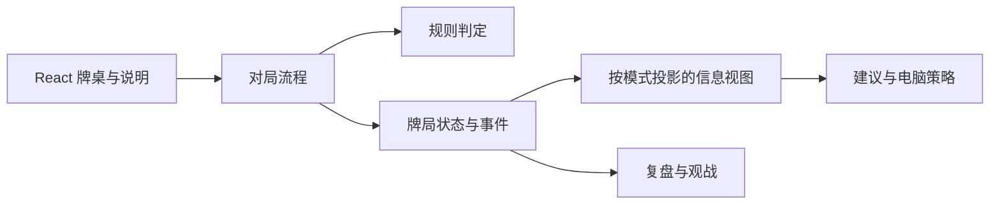

# 架构草图

> 本文记录模块边界。当前已有本地可试玩 V1；运行命令见 [README](README.md)。

## 第一阶段技术选择

采用 **TypeScript + React + Vite** 构建浏览器游戏。`src/game/tiles.ts` 与 `rules.ts` 处理牌和胡牌结构，`scoring.ts` 处理番型，`game.ts` 管理牌局状态与合法动作，`view.ts` 投影本家可见信息，`advice.ts` 给出启发式建议，`session.ts` 驱动电脑对手；`src/App.tsx` 展示牌桌并提交玩家动作。第一阶段不要求账号、服务端或 PostgreSQL；后续可将静态网页部署到公共地址。

选择依据：当前核心交互是持续更新的牌桌，规则和建议需要共享同一份牌局状态。纯浏览器实现可以先验证规则正确性、建议质量和教学体验，并可作为静态站点发布。技术栈对比及新增服务端的条件见下文。

| 方案                                    | 对本项目的适用情况                                                                                         |
| --------------------------------------- | ---------------------------------------------------------------------------------------------------------- |
| TypeScript + React + Vite               | 适合先完成浏览器对局、解释性建议和静态部署；本阶段采用。                                                   |
| TypeScript + React/Next.js + PostgreSQL | 适合需要账号、服务端功能和持久数据的阶段。Next.js 也能静态导出，但导出模式无法使用需要运行时服务端的功能。 |
| Python + FastAPI + PostgreSQL           | 适合在线提供复杂策略计算或数据服务；浏览器牌桌仍需单独的前端。                                             |

## 模块边界

- **规则判定**只回答动作是否合法、胡牌和计分结果，不依赖页面组件。
- **对局流程**管理换三张、定缺、摸打、碰杠胡及血战继续；用固定随机种子复现牌局。
- **建议与电脑策略**通过受限视图读取状态。玩家建议只能看到自己的手牌及公开信息；教学观战可以显示完整状态，但界面必须说明信息范围。
- **复盘**保存当时可见的信息、动作与理由。回放时不能用后来出现的牌解释过去的建议。
- **界面**展示状态并提交动作，合法性由规则与流程层判定。

图中的规则、状态、受限视图和建议已接入玩家对局。电脑按同样的受限视图作决策；复盘与观战仍是后续模块。页面展示对手的公开弃牌、碰杠与得分，不显示其暗牌。

## 何时增加服务端

| 需求出现时                                                       | 再评估的技术                                |
| ---------------------------------------------------------------- | ------------------------------------------- |
| 账号、跨设备牌谱和多人共享数据                                   | 服务端 API 与 PostgreSQL                    |
| 浏览器内策略计算经测量无法满足响应时间，或需要模型训练、批量模拟 | Python 计算模块；需要在线调用时再加 FastAPI |
| 需要服务端渲染、服务端路由或其他 Next.js 服务端能力              | Next.js                                     |

引入 Python 时应明确与 TypeScript 规则引擎之间的数据契约和一致性测试，避免两套规则对同一牌局给出不同结果。上述条件是后续决策门槛，不代表现在已经采用这些组件。

## 相关文档

- [docs/PROJECT_PLAN.md](docs/PROJECT_PLAN.md)：功能和规则范围。
- [docs/ENGINEERING.md](docs/ENGINEERING.md)：实现与验证流程。

技术选择参考：[Vite 静态部署](https://vite.dev/guide/static-deploy)、[Next.js 静态导出](https://nextjs.org/docs/app/guides/static-exports)、[FastAPI 数据库指南](https://fastapi.tiangolo.com/tutorial/sql-databases/)。
